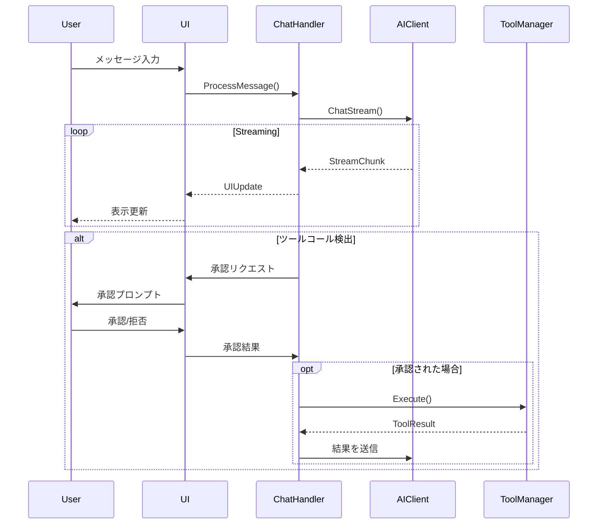

# CODA - 詳細設計書

## 1. アーキテクチャ概要

### 1.1 システム構成
```
┌─────────────────────────────────────────────────────────┐
│                  CODA CLI Application                    │
├─────────────────────────────────────────────────────────┤
│                   Presentation Layer                     │
│  ┌─────────────────┐  ┌──────────────────────────────┐ │
│  │  Cobra Commands │  │  Bubbletea UI Components    │ │
│  └─────────────────┘  └──────────────────────────────┘ │
├─────────────────────────────────────────────────────────┤
│                    Application Layer                     │
│  ┌────────────┐  ┌────────────┐  ┌─────────────────┐  │
│  │   Chat     │  │   Tool     │  │  Conversation   │  │
│  │  Handler   │  │  Manager   │  │    Manager      │  │
│  └────────────┘  └────────────┘  └─────────────────┘  │
├─────────────────────────────────────────────────────────┤
│                     Service Layer                        │
│  ┌────────────┐  ┌────────────┐  ┌─────────────────┐  │
│  │ AI Client  │  │   File     │  │    Config       │  │
│  │  Service   │  │  Service   │  │    Service      │  │
│  └────────────┘  └────────────┘  └─────────────────┘  │
├─────────────────────────────────────────────────────────┤
│                 Infrastructure Layer                     │
│  ┌────────────┐  ┌────────────┐  ┌─────────────────┐  │
│  │  OpenAI    │  │ FileSystem │  │     Viper       │  │
│  │   Client   │  │    I/O     │  │   Config        │  │
│  └────────────┘  └────────────┘  └─────────────────┘  │
└─────────────────────────────────────────────────────────┘
```

### 1.2 ディレクトリ構造
```
coda/
├── cmd/                    # CLIコマンド定義
│   ├── root.go            # ルートコマンド
│   ├── chat.go            # チャットコマンド
│   └── config.go          # 設定コマンド
├── internal/              # 内部パッケージ
│   ├── ai/               # AIクライアント
│   │   ├── client.go     # 統一インターフェース
│   │   ├── openai.go     # OpenAI実装
│   │   └── azure.go      # Azure OpenAI実装
│   ├── chat/             # チャット機能
│   │   ├── handler.go    # チャットハンドラー
│   │   ├── session.go    # セッション管理
│   │   └── stream.go     # ストリーミング処理
│   ├── tools/            # ツール実装
│   │   ├── manager.go    # ツールマネージャー
│   │   ├── file.go       # ファイル操作ツール
│   │   ├── search.go     # 検索ツール
│   │   └── command.go    # コマンド実行ツール
│   ├── ui/               # Bubbletea UI
│   │   ├── app.go        # メインアプリケーション
│   │   ├── chat_view.go  # チャットビュー
│   │   ├── input_view.go # 入力ビュー
│   │   └── styles.go     # スタイル定義
│   └── config/           # 設定管理
│       ├── config.go     # 設定構造体
│       └── loader.go     # 設定ローダー
├── pkg/                   # 公開パッケージ
│   └── types/            # 共通型定義
├── config/               # 設定ファイル
│   └── default.yaml      # デフォルト設定
├── docs/                 # ドキュメント
├── go.mod
├── go.sum
└── main.go
```

## 2. コンポーネント詳細設計

### 2.1 AIクライアント層

#### 2.1.1 統一インターフェース
```go
// internal/ai/client.go
type AIClient interface {
    // チャット補完をストリーミングで取得
    ChatStream(ctx context.Context, messages []Message, opts ChatOptions) (<-chan StreamChunk, error)
    
    // モデル一覧を取得
    ListModels(ctx context.Context) ([]Model, error)
    
    // プロバイダー名を取得
    Provider() string
}

type Message struct {
    Role    string // "system", "user", "assistant", "tool"
    Content string
}

type ChatOptions struct {
    Model           string
    Temperature     float32
    MaxTokens       int
    ReasoningEffort string // "low", "medium", "high" (o3モデル用)
}

type StreamChunk struct {
    Content         string
    FinishReason    string
    Error           error
    ReasoningSummary *ReasoningSummary // o3モデルの推論要約
}
```

#### 2.1.2 OpenAI実装
```go
// internal/ai/openai.go
type OpenAIClient struct {
    client *openai.Client
    config OpenAIConfig
}

func NewOpenAIClient(config OpenAIConfig) (*OpenAIClient, error) {
    client := openai.NewClient(config.APIKey)
    return &OpenAIClient{client: client, config: config}, nil
}
```

#### 2.1.3 Azure OpenAI実装
```go
// internal/ai/azure.go
type AzureOpenAIClient struct {
    client *openai.Client
    config AzureConfig
}

func NewAzureOpenAIClient(config AzureConfig) (*AzureOpenAIClient, error) {
    clientConfig := openai.DefaultAzureConfig(config.APIKey, config.Endpoint)
    client := openai.NewClientWithConfig(clientConfig)
    return &AzureOpenAIClient{client: client, config: config}, nil
}
```

### 2.2 ツールシステム

#### 2.2.1 ツールインターフェース
```go
// internal/tools/manager.go
type Tool interface {
    Name() string
    Description() string
    Schema() ToolSchema
    Execute(ctx context.Context, args map[string]interface{}) (ToolResult, error)
}

type ToolSchema struct {
    Parameters map[string]Parameter
    Required   []string
}

type ToolResult struct {
    Success bool
    Output  interface{}
    Error   string
}

type ToolManager struct {
    tools map[string]Tool
}
```

#### 2.2.2 ツール実装例
```go
// internal/tools/file.go
type ReadFileTool struct{}

func (t *ReadFileTool) Name() string {
    return "read_file"
}

func (t *ReadFileTool) Description() string {
    return "Read the contents of a file"
}

func (t *ReadFileTool) Schema() ToolSchema {
    return ToolSchema{
        Parameters: map[string]Parameter{
            "path": {Type: "string", Description: "File path to read"},
        },
        Required: []string{"path"},
    }
}

func (t *ReadFileTool) Execute(ctx context.Context, args map[string]interface{}) (ToolResult, error) {
    path, ok := args["path"].(string)
    if !ok {
        return ToolResult{Success: false, Error: "path parameter required"}, nil
    }
    
    content, err := os.ReadFile(path)
    if err != nil {
        return ToolResult{Success: false, Error: err.Error()}, nil
    }
    
    return ToolResult{Success: true, Output: string(content)}, nil
}
```

### 2.3 システムプロンプト設計

#### 2.3.1 プロンプト構成
```go
// internal/chat/prompts.go
const DefaultSystemPrompt = `You are CODA, an advanced AI coding assistant powered by Go and designed to help developers with various programming tasks.

## Core Capabilities
- **Code Analysis**: Analyze code structure, patterns, and potential improvements
- **Code Generation**: Generate code based on specifications and best practices
- **Code Refactoring**: Suggest and implement code improvements
- **Documentation**: Create and update documentation
- **Debugging**: Help identify and fix bugs
- **Testing**: Write and improve test cases

## Available Tools
You have access to the following tools:
- **read_file**: Read file contents
- **write_file**: Create or overwrite files
- **edit_file**: Make targeted edits to existing files
- **list_files**: List directory contents
- **search_files**: Search for patterns in files
- **run_command**: Execute shell commands (with user approval)

## Tool Calling Protocol
When you need to use a tool, respond with a JSON object in this exact format:
` + "```json\n{\"tool\": \"tool_name\", \"arguments\": {\"param1\": \"value1\"}}\n```" + `

CRITICAL RULES:
1. Output ONLY the JSON when calling a tool - no additional text
2. Always start with {"tool": for tool detection
3. One tool call per message
4. Use separator '\n----\n' when combining explanation with tool execution

## Response Guidelines
1. Be concise and focused on the task
2. Use markdown formatting for code and structure
3. Provide actionable suggestions
4. Explain complex concepts when needed
5. Follow the user's coding style and conventions

## Best Practices
- Always verify file existence before operations
- Preserve code formatting and style
- Consider security implications
- Suggest incremental improvements
- Provide clear error messages

Remember: Your goal is to be a helpful, efficient coding assistant.`

func BuildSystemPrompt(userPrompt string, workspacePrompt string) string {
    prompt := DefaultSystemPrompt
    
    if workspacePrompt != "" {
        prompt += "\n\n## Workspace-Specific Instructions\n" + workspacePrompt
    }
    
    if userPrompt != "" {
        prompt += "\n\n## User-Specific Instructions\n" + userPrompt
    }
    
    return prompt
}
```

#### 2.3.2 ワークスペースプロンプトの読み込み
```go
// internal/chat/workspace.go
func LoadWorkspacePrompt() (string, error) {
    // CLAUDE.md または CODA.md を検索
    files := []string{"CLAUDE.md", "CODA.md"}
    
    for _, file := range files {
        if content, err := os.ReadFile(file); err == nil {
            return string(content), nil
        }
    }
    
    return "", nil
}
```

### 2.4 ユーザーインターフェース設計

#### 2.4.1 Bubbletea アプリケーション構造
```go
// internal/ui/app.go
type App struct {
    chatView  *ChatView
    inputView *InputView
    session   *chat.Session
    client    ai.AIClient
    tools     *tools.ToolManager
    config    *config.Config
}

type Model struct {
    app          *App
    width        int
    height       int
    activeView   string // "chat" or "input"
    err          error
}

func (m Model) Init() tea.Cmd {
    return tea.EnterAltScreen
}

func (m Model) Update(msg tea.Msg) (tea.Model, tea.Cmd) {
    switch msg := msg.(type) {
    case tea.KeyMsg:
        switch msg.String() {
        case "ctrl+c", "q":
            return m, tea.Quit
        case "tab":
            m.toggleView()
        }
    case tea.WindowSizeMsg:
        m.width = msg.Width
        m.height = msg.Height
        m.updateLayout()
    }
    
    // デリゲート to active view
    return m, nil
}
```

#### 2.4.2 チャットビュー
```go
// internal/ui/chat_view.go
type ChatView struct {
    messages  []ChatMessage
    viewport  viewport.Model
    style     ChatStyle
}

type ChatMessage struct {
    Role      string
    Content   string
    Timestamp time.Time
    Metadata  map[string]interface{}
}

func (v *ChatView) Render() string {
    var content strings.Builder
    
    for _, msg := range v.messages {
        switch msg.Role {
        case "user":
            content.WriteString(v.style.UserMessage.Render(msg.Content))
        case "assistant":
            content.WriteString(v.style.AssistantMessage.Render(msg.Content))
        case "system":
            content.WriteString(v.style.SystemMessage.Render(msg.Content))
        case "tool":
            content.WriteString(v.style.ToolMessage.Render(msg.Content))
        }
        content.WriteString("\n\n")
    }
    
    return v.viewport.View()
}
```

#### 2.4.3 入力ビュー
```go
// internal/ui/input_view.go
type InputView struct {
    textinput textinput.Model
    style     InputStyle
}

func NewInputView() *InputView {
    ti := textinput.New()
    ti.Placeholder = "Type your message..."
    ti.CharLimit = 2000
    ti.Width = 80
    
    return &InputView{
        textinput: ti,
        style:     DefaultInputStyle(),
    }
}
```

### 2.5 設定管理

#### 2.5.1 設定構造体
```go
// internal/config/config.go
type Config struct {
    AI       AIConfig       `yaml:"ai"`
    UI       UIConfig       `yaml:"ui"`
    Tools    ToolsConfig    `yaml:"tools"`
    Security SecurityConfig `yaml:"security"`
}

type AIConfig struct {
    Provider string         `yaml:"provider"` // "openai" or "azure"
    OpenAI   OpenAIConfig   `yaml:"openai"`
    Azure    AzureConfig    `yaml:"azure"`
}

type OpenAIConfig struct {
    APIKey string   `yaml:"api_key"`
    Model  string   `yaml:"model"`
    Models []string `yaml:"models"` // 利用可能なモデル一覧
}

type AzureConfig struct {
    Endpoint       string `yaml:"endpoint"`
    APIKey         string `yaml:"api_key"`
    DeploymentName string `yaml:"deployment_name"`
    APIVersion     string `yaml:"api_version"`
}

type UIConfig struct {
    Theme             string `yaml:"theme"`
    SyntaxHighlighting bool   `yaml:"syntax_highlighting"`
    ShowLineNumbers   bool   `yaml:"show_line_numbers"`
}

type ToolsConfig struct {
    Enabled []string          `yaml:"enabled"`
    Custom  map[string]string `yaml:"custom"` // カスタムツールのパス
}

type SecurityConfig struct {
    AllowedPaths     []string `yaml:"allowed_paths"`
    RestrictedPaths  []string `yaml:"restricted_paths"`
    MaxFileSize      int64    `yaml:"max_file_size"`
    DangerousPatterns []string `yaml:"dangerous_patterns"`
}
```

#### 2.5.2 設定ファイル例
```yaml
# config.yaml
ai:
  provider: "openai"
  
  openai:
    api_key: "${OPENAI_API_KEY}"
    model: "o3"
    models:
      - "o3"
      - "gpt-4-turbo"
      - "o3"
      - "o4-mini"
    
  azure:
    endpoint: "${AZURE_ENDPOINT}"
    api_key: "${AZURE_API_KEY}"
    deployment_name: "o3"
    api_version: "2024-02-01"

ui:
  theme: "dark"
  syntax_highlighting: true
  show_line_numbers: true
  
tools:
  enabled:
    - read_file
    - write_file
    - edit_file
    - list_files
    - search_files
    - run_command
    
security:
  allowed_paths:
    - "."
    - "./src"
  restricted_paths:
    - "/etc"
    - "/var"
  max_file_size: 10485760  # 10MB
  dangerous_patterns:
    - "\.env$"
    - "\.pem$"
    - "password"
    - "secret"
```

### 2.6 ストリーミング処理

#### 2.6.1 メッセージストリーミング
```go
// internal/chat/stream.go
type StreamHandler struct {
    client   ai.AIClient
    session  *Session
    tools    *tools.ToolManager
    ui       chan<- UIUpdate
}

func (h *StreamHandler) ProcessMessage(content string) error {
    messages := h.buildMessages(content)
    
    streamChan, err := h.client.ChatStream(context.Background(), messages, ai.ChatOptions{
        Model: h.session.Model,
    })
    
    if err != nil {
        return err
    }
    
    var fullResponse strings.Builder
    
    for chunk := range streamChan {
        if chunk.Error != nil {
            return chunk.Error
        }
        
        fullResponse.WriteString(chunk.Content)
        
        // UIに増分更新を送信
        h.ui <- UIUpdate{
            Type:    "stream",
            Content: chunk.Content,
        }
        
        // ツールコール検出
        if h.detectToolCall(fullResponse.String()) {
            return h.handleToolCall(fullResponse.String())
        }
    }
    
    // メッセージを保存
    h.session.AddMessage("assistant", fullResponse.String())
    
    return nil
}
```

#### 2.6.2 ツールコール処理
```go
// internal/chat/tools.go
func (h *StreamHandler) detectToolCall(content string) bool {
    // JSONブロックの検出
    return strings.Contains(content, "```json") && 
           strings.Contains(content, `"tool":`)
}

func (h *StreamHandler) handleToolCall(content string) error {
    // JSONを抽出
    start := strings.Index(content, "```json")
    end := strings.Index(content[start:], "```") + start
    
    if start == -1 || end == -1 {
        return fmt.Errorf("invalid tool call format")
    }
    
    jsonStr := content[start+7 : end]
    
    var toolCall ToolCall
    if err := json.Unmarshal([]byte(jsonStr), &toolCall); err != nil {
        return err
    }
    
    // ユーザー承認を求める
    approval := h.requestApproval(toolCall)
    if !approval {
        h.session.AddMessage("system", "Tool execution rejected by user")
        return nil
    }
    
    // ツール実行
    result, err := h.tools.Execute(toolCall.Tool, toolCall.Arguments)
    if err != nil {
        return err
    }
    
    // 結果を処理
    return h.processToolResult(toolCall.Tool, result)
}
```

### 2.7 エラーハンドリング

#### 2.7.1 エラー型定義
```go
// pkg/types/errors.go
type ErrorType string

const (
    ErrorTypeAPI         ErrorType = "api_error"
    ErrorTypeAuth        ErrorType = "auth_error"
    ErrorTypeRateLimit   ErrorType = "rate_limit"
    ErrorTypeValidation  ErrorType = "validation_error"
    ErrorTypeFileSystem  ErrorType = "filesystem_error"
    ErrorTypeTool        ErrorType = "tool_error"
)

type CodaError struct {
    Type    ErrorType
    Message string
    Details map[string]interface{}
    Wrapped error
}

func (e *CodaError) Error() string {
    return fmt.Sprintf("[%s] %s", e.Type, e.Message)
}
```

### 2.8 セキュリティ考慮事項

#### 2.8.1 ファイルアクセス制御
```go
// internal/security/validator.go
type FileAccessValidator struct {
    config SecurityConfig
}

func (v *FileAccessValidator) ValidatePath(path string) error {
    // 絶対パスに変換
    absPath, err := filepath.Abs(path)
    if err != nil {
        return err
    }
    
    // 許可されたパスかチェック
    allowed := false
    for _, allowedPath := range v.config.AllowedPaths {
        if strings.HasPrefix(absPath, allowedPath) {
            allowed = true
            break
        }
    }
    
    if !allowed {
        return fmt.Errorf("access denied: path not in allowed list")
    }
    
    // 制限されたパスかチェック
    for _, restrictedPath := range v.config.RestrictedPaths {
        if strings.HasPrefix(absPath, restrictedPath) {
            return fmt.Errorf("access denied: restricted path")
        }
    }
    
    // 危険なパターンをチェック
    for _, pattern := range v.config.DangerousPatterns {
        if matched, _ := regexp.MatchString(pattern, path); matched {
            return fmt.Errorf("access denied: dangerous file pattern")
        }
    }
    
    return nil
}
```

#### 2.8.2 APIキー管理
```go
// internal/config/secrets.go
func LoadAPIKey(envVar string) (string, error) {
    // 環境変数から読み込み
    if key := os.Getenv(envVar); key != "" {
        return key, nil
    }
    
    // キーチェーンから読み込み（macOS）
    if runtime.GOOS == "darwin" {
        return keychain.GetPassword("coda", envVar)
    }
    
    return "", fmt.Errorf("API key not found")
}
```

## 3. 実装フロー

### 3.1 チャットフロー


### 3.2 初期化フロー
```go
// cmd/root.go
func initializeApp() (*App, error) {
    // 1. 設定読み込み
    cfg, err := config.Load()
    if err != nil {
        return nil, err
    }
    
    // 2. AIクライアント初期化
    var client ai.AIClient
    switch cfg.AI.Provider {
    case "openai":
        client, err = ai.NewOpenAIClient(cfg.AI.OpenAI)
    case "azure":
        client, err = ai.NewAzureOpenAIClient(cfg.AI.Azure)
    default:
        return nil, fmt.Errorf("unknown provider: %s", cfg.AI.Provider)
    }
    
    // 3. ツールマネージャー初期化
    toolMgr := tools.NewManager()
    for _, toolName := range cfg.Tools.Enabled {
        toolMgr.Register(toolName)
    }
    
    // 4. UIアプリケーション作成
    app := &App{
        client: client,
        tools:  toolMgr,
        config: cfg,
    }
    
    return app, nil
}
```

## 4. 拡張性の考慮

### 4.1 プラグインシステム
```go
// pkg/plugin/interface.go
type Plugin interface {
    Name() string
    Version() string
    Initialize(context.Context) error
    RegisterTools(*tools.ToolManager) error
    RegisterCommands(*cobra.Command) error
}
```

### 4.2 カスタムツールの追加
```go
// example/custom_tool.go
type CustomTool struct {
    // カスタムフィールド
}

func (t *CustomTool) Name() string {
    return "custom_tool"
}

// Tool インターフェースの実装...
```

## 5. テスト戦略

### 5.1 単体テスト
- 各コンポーネントの独立したテスト
- モックを使用した依存関係の分離
- テーブル駆動テストの活用

### 5.2 統合テスト
- AIクライアントとツールの統合テスト
- ストリーミング処理のテスト
- エラーシナリオのテスト

### 5.3 E2Eテスト
- 実際のユーザーシナリオのテスト
- UIインタラクションのテスト
- パフォーマンステスト